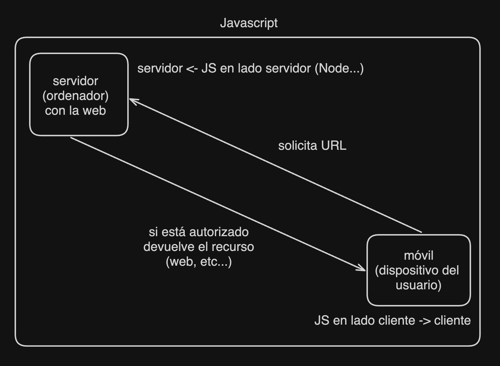

# learn-js
Repositorio para aprender Javascript

## Teoría

  - [Introducción a Javascript de W3schools](https://www.w3schools.com/js/default.asp) 
  - Hay teoría también en FreeCodeCamp

## Ejercicios

  - [Ejercicios por temas de Espacio Aulascript](https://www.aulascript.com/)
  - Hay muchos ejercicios en FreeCodeCamp

## Certificados

  - [Certificado Legacy de Javascript](https://www.freecodecamp.org/learn/javascript-algorithms-and-data-structures/)
  - [Certificado Beta de Javascript](https://www.freecodecamp.org/learn/javascript-algorithms-and-data-structures-v8/)

  **Nota:** El certificado Beta de Javascript no está actualizado al completo y las explicaciones son uy cortas que el Legacy.

---

Diagrama de donde se puede usar Javascript (cliente o servidor)

## Temas de Javascript (cliente o frontend)

  1. Sintáxis de JS (comentarios, punto y coma, mayúsculas y minúsculas, sensibilidad a mayúsculas y minúsculas) en [01.sintaxis.html](cliente/01.sintaxis.html)
  2. Variables (declaraciones, camelCase, let, const, var) [02.variables.html](cliente/02.variables.html)
  3. Operadores (aritméticos, de asignación, de comparación, lógicos, ternario) [03.operadores.html](cliente/03.operadores.html)
  4. Tipos primitivos (string, number, boolean, null, undefined, symbol) [04.tipos_de_datos.html](cliente/04.tipos_de_datos.html)
  5. Funciones en JS (declaración, expresión, arrow function, parámetros, argumentos, return) [05.funciones.html](cliente/05.funciones.html)
  6. Bucles en JS (for, while, do while, break, continue) [06.Bucles](cliente/06.bucles.html)
  7. Estructuras de datos (array, object, date, math, JSON)
  8. Objetos en JS (declaración, propiedades, métodos, this)
  9. Clases y objetos en JS (declaración, constructor, métodos, herencia)
  10. DOM (document, getElementById, querySelector, innerHTML, textContent, createElement, appendChild, removeChild)

## Temas de Javascript (servidor o backend)
  
    1. Node.js 
    2. Express.js 
    3. Base de datos
    4. Uso de archivos
    5. Despliegue