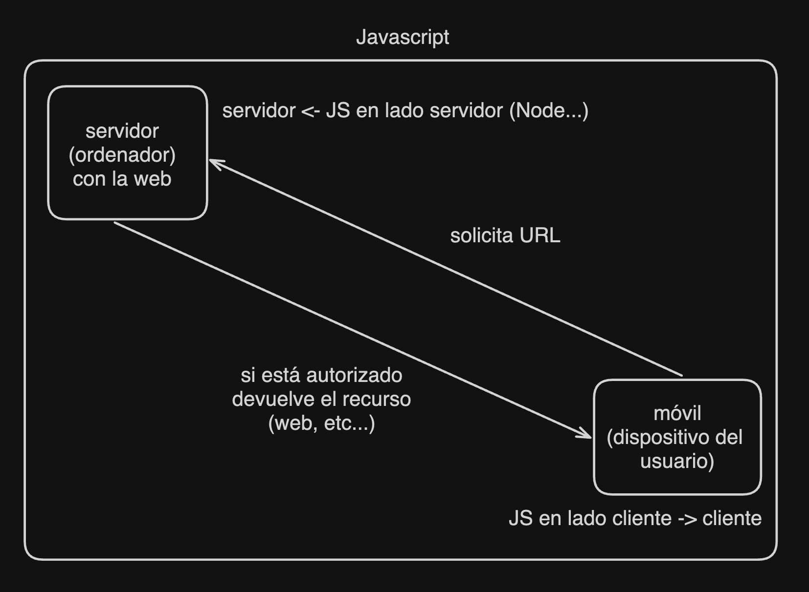

# learn-js
Repositorio para aprender Javascript

## Libro

- [Eloquent Javascript (3rd ed)](https://eloquentjavascript.net/)
  - [Versión en español (2da ed)](https://eloquentjs-es.thedojo.mx/)

## Teoría

  - [Introducción a Javascript de W3schools](https://www.w3schools.com/js/default.asp) 
  - Hay teoría también en FreeCodeCamp

## Ejercicios

  - [Ejercicios por temas de Espacio Aulascript](https://www.aulascript.com/)
  - Hay muchos ejercicios en FreeCodeCamp

## Certificados

  - [Certificado Legacy de Javascript](https://www.freecodecamp.org/learn/javascript-algorithms-and-data-structures/)
  - [Certificado Beta de Javascript](https://www.freecodecamp.org/learn/javascript-algorithms-and-data-structures-v8/)

  **Nota:** El certificado Beta de Javascript no está actualizado al completo y las explicaciones son uy cortas que el Legacy.

---

Diagrama de donde se puede usar Javascript (cliente o servidor)

## Temas de Javascript (cliente o frontend)

  El temario de lado cliente / front-end está en [cliente](./cliente/).

  1. Sintáxis de JS (comentarios, punto y coma, mayúsculas y minúsculas, sensibilidad a mayúsculas y minúsculas) en [01.sintaxis](cliente/01.sintaxis.html)

  2. Variables (declaraciones, camelCase, let, const, var) 
  - [02.variables](cliente/02.variables.html)

  3. Operadores (aritméticos, de asignación, de comparación, lógicos, ternario) 
  - [03.operadores](cliente/03.operadores.html)

  ---

  4. Tipos primitivos (string, number, boolean, null, undefined, symbol) [04.tipos_de_datos.html](cliente/04.tipos_de_datos.html)
  
  5. Funciones en JS (declaración, expresión, arrow function, parámetros, argumentos, return) 
  
  6. Bucles en JS (for, while, do while, break, continue) 
   - [06.Condicionales](cliente/06.condicionales.html)
  
  7. Estructuras de datos (array, object, date, math, JSON) -> POO

  8. Objetos en JS (declaración, propiedades, métodos, this) -> POO

  9. Clases y objetos en JS (declaración, constructor, métodos, herencia) -> POO

  10. DOM (document, getElementById, querySelector, innerHTML, textContent, createElement, appendChild, removeChild) -> Navegador // Web

## Temas de Javascript (servidor o backend)
  El contenido de Javascript para back-end está en [servidor](./servidor/)
    
    1. Node.js 

    2. Express.js 

    3. Base de datos

    4. Uso de archivos

    5. Despliegue

## Módulos adicionales

  - [Machine Learning](./machine-learning-ai/)
  - Blockchain
  - APIs
  - Otros